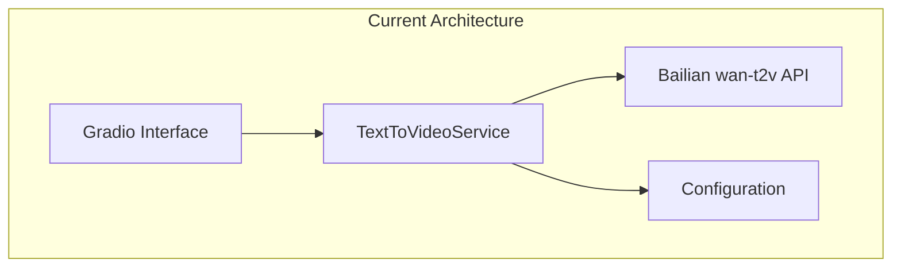
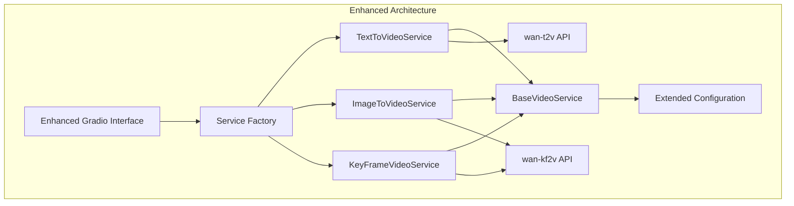
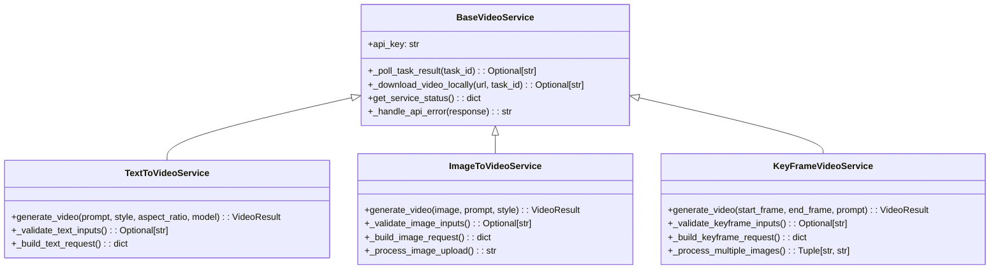
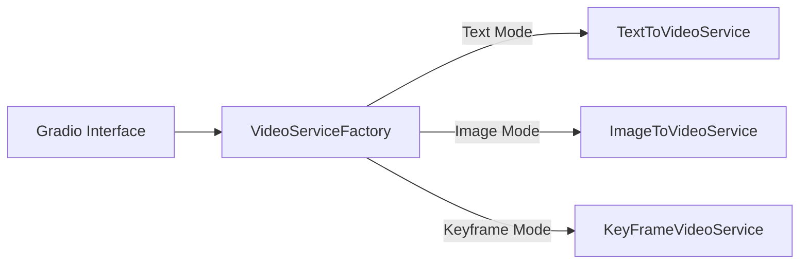
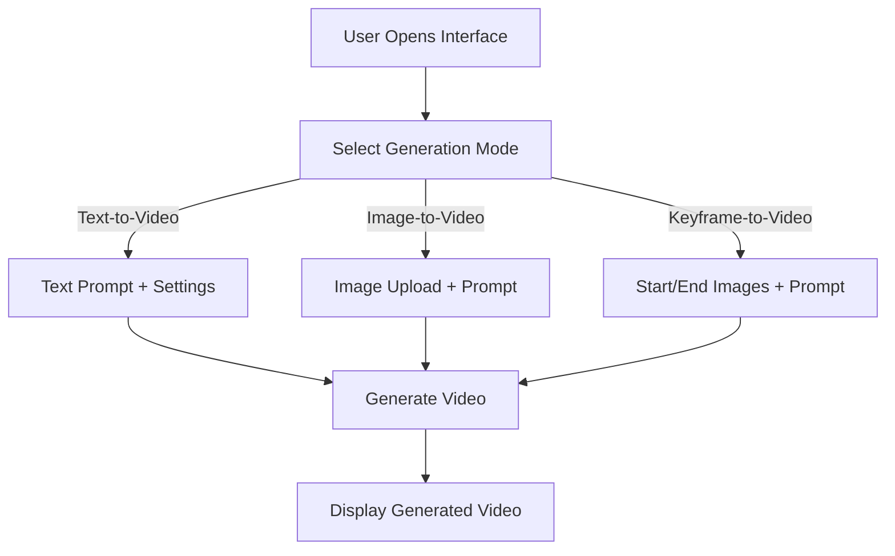
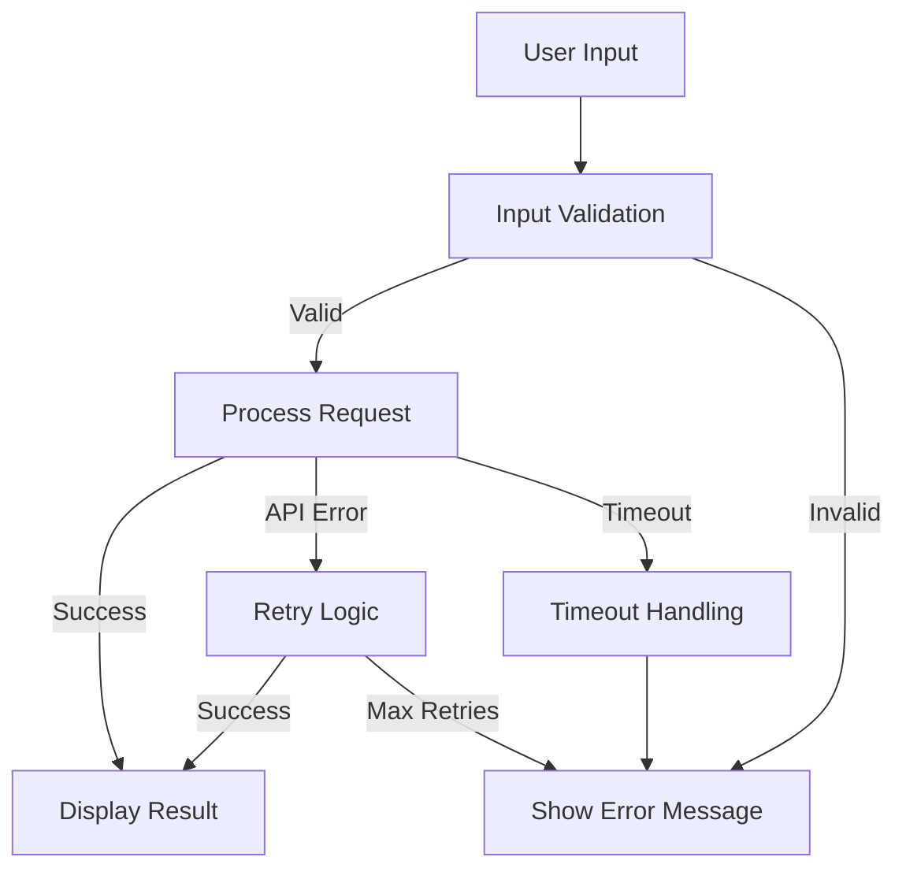

# Add Video Generation Modules Design

## Overview

This design document outlines the extension of the Wan_Gateway application to support two additional video generation modes beyond the current text-to-video functionality. The new modules will enable image-to-video generation (from a single frame) and keyframe-to-video generation (from start and end frames), providing users with comprehensive video creation capabilities through a unified Gradio interface.

## Architecture

### Current System Architecture

The existing system follows a service-oriented architecture with clear separation between the UI layer (Gradio), service layer (TextToVideoService), and external API integration (Bailian wan-t2v API).



### Enhanced Architecture Design

The enhanced architecture introduces a base service pattern with specialized services for each generation mode, maintaining consistency while enabling mode-specific functionality.



### Component Structure



## Component Architecture

### Base Video Service Layer

The `BaseVideoService` class provides common functionality shared across all video generation modes:

**Core Responsibilities:**
- Task polling and status management
- Video download and local storage
- Error handling and retry logic
- Service status reporting
- Common validation utilities

**Key Methods:**
- `_poll_task_result(task_id)`: Handles asynchronous task polling with appropriate intervals
- `_download_video_locally(video_url, task_id)`: Downloads generated videos for local access
- `get_service_status()`: Reports API connectivity and service health
- `_handle_api_error(response)`: Standardized error processing

### Specialized Service Classes

#### TextToVideoService (Enhanced)
**API Integration:** Bailian wan-t2v API (`/video-generation/video-synthesis`)
**Processing Time:** 1-2 minutes
**Supported Models:** wan2.2-t2v-plus, wanx2.1-t2v-turbo, wanx2.1-t2v-plus

**Input Parameters:**
- Text prompt (required)
- Style selection (optional)
- Aspect ratio (16:9, 1:1, 9:16)
- Model selection
- Negative prompt (optional)
- Seed value (optional)

#### ImageToVideoService (New)
**API Integration:** Bailian wan-kf2v API (`/image2video/video-synthesis`)
**Processing Time:** 7-10 minutes
**Supported Models:** wanx2.1-kf2v-plus

**Input Parameters:**
- First frame image (required)
- Text prompt (optional)
- Style guidance (optional)

**Implementation Strategy:**
- Utilizes kf2v API with `first_frame_url` parameter
- Omits `last_frame_url` to enable single-image generation
- Handles image upload, validation, and format conversion

#### KeyFrameVideoService (New)
**API Integration:** Bailian wan-kf2v API (`/image2video/video-synthesis`)
**Processing Time:** 7-10 minutes
**Supported Models:** wanx2.1-kf2v-plus

**Input Parameters:**
- Start frame image (required)
- End frame image (required)
- Text prompt (optional for guidance)

**Implementation Strategy:**
- Uses kf2v API with both `first_frame_url` and `last_frame_url`
- Manages dual image upload and processing
- Provides transition control between keyframes

### Service Factory Pattern



**Factory Responsibilities:**
- Mode-based service instantiation
- Configuration injection
- Service lifecycle management
- Error handling coordination

## Gradio Interface Enhancement

### Mode Selection Interface

The enhanced Gradio interface provides intuitive mode switching with conditional input display:



### Interface Component Design

#### Mode Selector Component
```python
mode_selector = gr.Radio(
    choices=["Text-to-Video", "Image-to-Video", "Keyframe-to-Video"],
    label="Generation Mode",
    value="Text-to-Video"
)
```

#### Conditional Input Groups
**Text-to-Video Inputs:**
- Text prompt (multiline)
- Model selection (radio)
- Style options (dropdown)
- Aspect ratio (radio)
- Advanced settings (negative prompt, seed)

**Image-to-Video Inputs:**
- Image upload component
- Optional text prompt
- Style guidance options

**Keyframe-to-Video Inputs:**
- Start frame upload
- End frame upload
- Optional transition prompt

### Input Validation and User Feedback

**Image Upload Validation:**
- Format checking (JPEG, PNG, BMP, WEBP)
- Size validation (max 10MB)
- Dimension verification (360px - 2000px)
- Aspect ratio guidance

**Processing Time Indicators:**
- Text-to-Video: "Processing... (typically 1-2 minutes)"
- Image/Keyframe-to-Video: "Processing... (typically 7-10 minutes)"
- Real-time progress updates

## Data Models

### Enhanced VideoResult Model

```python
@dataclass
class VideoResult:
    success: bool
    video_url: Optional[str] = None
    local_video_path: Optional[str] = None
    error_message: Optional[str] = None
    task_id: Optional[str] = None
    generation_time: Optional[float] = None
    generation_mode: Optional[str] = None  # New field
    model_used: Optional[str] = None       # New field
    input_metadata: Optional[dict] = None  # New field
```

### Image Processing Model

```python
@dataclass
class ImageInput:
    file_path: str
    base64_data: str
    format: str
    dimensions: Tuple[int, int]
    file_size_mb: float
    validation_status: bool
    upload_timestamp: float
```

## Configuration Management

### Extended Configuration Structure

The configuration system extends to support multiple APIs and generation modes:

```python
class Config:
    # Existing T2V Configuration
    TEXT_TO_VIDEO_CONFIG = {
        "api_endpoint": "/video-generation/video-synthesis",
        "models": ["wan2.2-t2v-plus", "wanx2.1-t2v-turbo", "wanx2.1-t2v-plus"],
        "processing_time_range": "1-2 minutes"
    }
    
    # New I2V/K2V Configuration  
    KEYFRAME_VIDEO_CONFIG = {
        "api_endpoint": "/image2video/video-synthesis",
        "models": ["wanx2.1-kf2v-plus"],
        "processing_time_range": "7-10 minutes",
        "max_poll_time": 900  # 15 minutes
    }
    
    # Image Upload Configuration
    IMAGE_UPLOAD_CONFIG = {
        "max_size_mb": 10,
        "allowed_formats": ["JPEG", "PNG", "BMP", "WEBP"],
        "min_dimension": 360,
        "max_dimension": 2000,
        "temp_storage_hours": 1
    }
```

### Mode-Specific Settings

**Polling Configuration:**
- Text-to-Video: 15-second intervals, 5-minute timeout
- Image/Keyframe-to-Video: 30-second intervals, 15-minute timeout

**Model Availability:**
- Text modes: All wan-t2v models
- Image modes: wanx2.1-kf2v-plus only

## Error Handling and Validation

### Input Validation Strategy



### Error Categories and Handling

**Image Validation Errors:**
- Invalid format: "Please upload JPEG, PNG, BMP, or WEBP images"
- Size exceeded: "Image must be smaller than 10MB"
- Dimension issues: "Image dimensions must be between 360px and 2000px"

**API Integration Errors:**
- Network timeouts: Automatic retry with exponential backoff
- Rate limiting: Queue management and user notification
- Service unavailable: Graceful degradation and status reporting

**Processing Errors:**
- Content policy violations: Clear explanation and guidance
- Generation failures: Retry options and alternative suggestions

## Testing Strategy

### Unit Testing Framework

**Service Layer Testing:**
- BaseVideoService common functionality
- Each specialized service in isolation
- Image processing and validation
- API request building and response handling

**Integration Testing:**
- End-to-end generation workflows
- Image upload and processing pipelines
- Error scenario simulation
- Performance and timeout testing

**UI Testing:**
- Mode switching functionality
- Conditional input display
- File upload component validation
- Result display consistency

### Test Data Management

**Image Test Assets:**
- Various formats and sizes
- Edge cases (very small/large images)
- Invalid formats for error testing
- Aspect ratio variations

**API Response Mocking:**
- Success scenarios for all modes
- Error responses and edge cases
- Timeout simulation
- Rate limiting scenarios