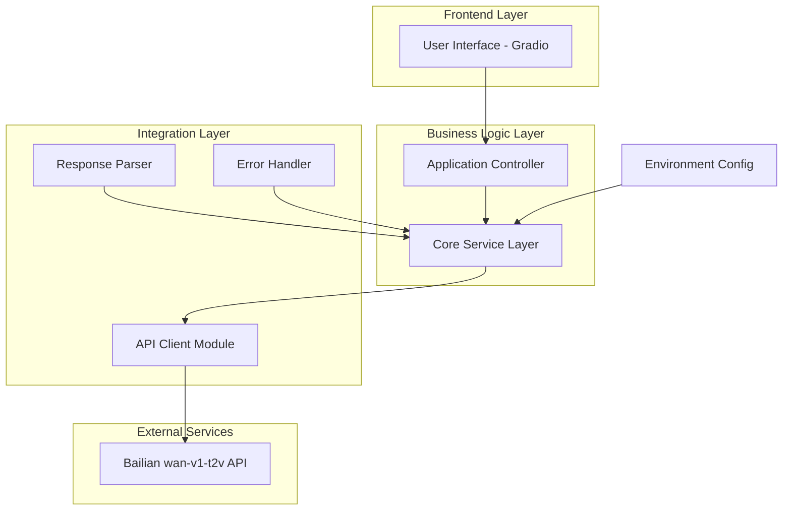
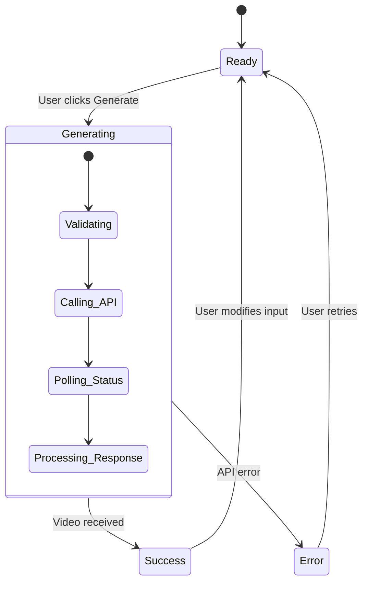
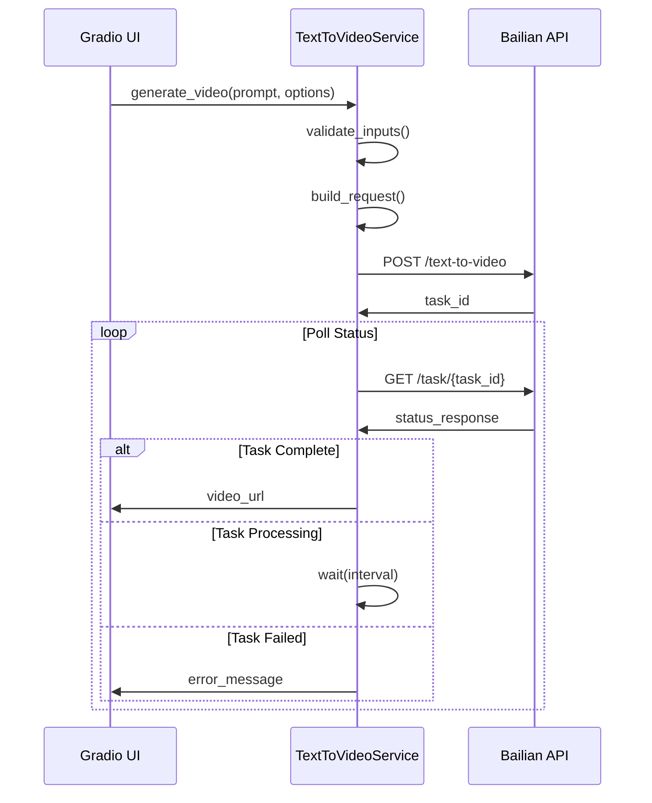
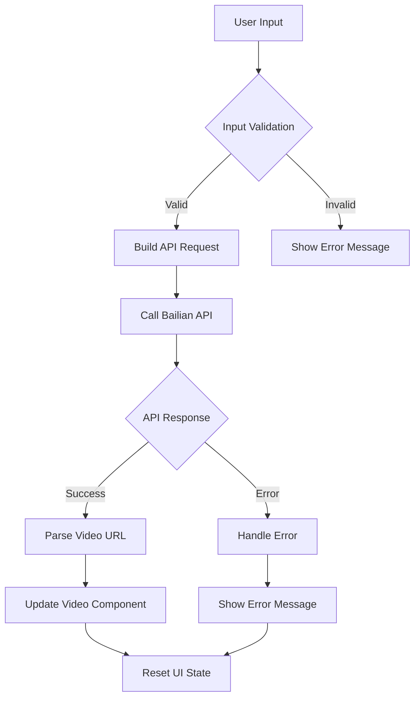

# Gradio Text-to-Video Application Design

## Overview

This document outlines the design for a comprehensive text-to-video web application built with Gradio, integrating Alibaba's Bailian "wan-v1-t2v" API. The application provides an intuitive user interface for generating videos from text descriptions with customizable parameters and professional UX features.

## Technology Stack & Dependencies

### Core Technologies
- **Python 3.8+**: Primary development language
- **Gradio**: Web interface framework for machine learning applications
- **Requests**: HTTP client for API communication
- **python-dotenv**: Environment variable management
- **asyncio**: Asynchronous programming support

### API Integration
- **Bailian wan-v1-t2v API**: Text-to-video generation service
- **DashScope SDK**: Official Python SDK for Alibaba Cloud services

### Development Dependencies
- **pytest**: Unit testing framework
- **python-dotenv**: Development environment management

## Architecture

### System Architecture Overview



### Component Architecture

#### 1. Core Service Layer (`text_to_video_service.py`)
- **API Client**: Handles authentication and HTTP requests
- **Request Builder**: Formats API request parameters
- **Response Parser**: Processes API responses and extracts video URLs
- **Error Handler**: Manages API errors and timeout scenarios

#### 2. Gradio Interface Layer (`gradio_app.py`)
- **UI Components**: Input forms, dropdowns, and video display
- **Event Handlers**: Button clicks and form submissions
- **State Management**: Loading states and user feedback
- **Layout Manager**: Responsive design and component organization

#### 3. Configuration Module (`config.py`)
- **Environment Variables**: API key and endpoint configuration
- **Default Settings**: Pre-defined options for dropdowns
- **Validation Rules**: Input parameter constraints

## API Integration Layer

### Bailian wan-v1-t2v Integration

#### Request Format
```python
{
    "model": "wanx-v1",
    "input": {
        "text": "user_prompt_text",
        "style": "selected_style",
        "aspect_ratio": "selected_ratio"
    },
    "parameters": {
        "negative_prompt": "optional_negative_prompt",
        "seed": "optional_seed_value"
    }
}
```

#### Response Handling
- **Asynchronous Processing**: Handle task creation and result polling
- **Status Monitoring**: Track generation progress
- **Resource Management**: Handle temporary video URLs
- **Error Recovery**: Retry logic for failed requests

#### Authentication & Security
- **API Key Management**: Secure environment variable storage
- **Request Signing**: Proper authentication headers
- **Rate Limiting**: Respect API quotas and limits
- **Error Logging**: Secure logging without exposing credentials

## User Interface Design

### Primary Interface Components

#### Main Input Section
| Component | Type | Description |
|-----------|------|-------------|
| Prompt Input | `gr.Textbox` | Large text area for video description |
| Style Selector | `gr.Dropdown` | Pre-defined style options |
| Aspect Ratio | `gr.Dropdown` | Video dimension options |
| Generate Button | `gr.Button` | Trigger video generation |

#### Advanced Settings (Collapsible)
| Component | Type | Description |
|-----------|------|-------------|
| Negative Prompt | `gr.Textbox` | Optional exclusion terms |
| Seed Value | `gr.Number` | Optional reproducibility seed |

#### Output Section
| Component | Type | Description |
|-----------|------|-------------|
| Video Display | `gr.Video` | Generated video player |
| Status Message | `gr.Textbox` | Generation status updates |

### UI State Management



### Dropdown Options Configuration

#### Style Options
```python
STYLE_OPTIONS = [
    "<auto>",           # Automatic style selection
    "Cinematic",        # Movie-like quality
    "Anime",           # Animation style
    "Realistic",       # Photorealistic
    "Abstract",        # Artistic abstract
    "Documentary",     # Documentary style
    "Commercial"       # Advertisement style
]
```

#### Aspect Ratio Options
```python
ASPECT_RATIO_OPTIONS = [
    "16:9",    # Widescreen format
    "1:1",     # Square format
    "9:16"     # Portrait/mobile format
]
```

## Core Service Implementation

### Text-to-Video Service Class

#### Service Interface
```python
class TextToVideoService:
    def __init__(self, api_key: str)
    async def generate_video(self, prompt: str, **kwargs) -> VideoResult
    def _build_request(self, prompt: str, **kwargs) -> dict
    def _parse_response(self, response: dict) -> VideoResult
    def _handle_errors(self, error: Exception) -> str
```

#### Request Processing Flow


### Error Handling Strategy

#### Error Categories
| Error Type | Handling Strategy | User Message |
|------------|------------------|--------------|
| Authentication | Retry with fresh token | "Authentication failed, please check API key" |
| Rate Limit | Exponential backoff | "Service busy, please wait and retry" |
| Invalid Input | Input validation | "Please check your input parameters" |
| Network Error | Retry mechanism | "Connection error, retrying..." |
| API Error | Error logging | "Service temporarily unavailable" |

## Data Flow Architecture

### Input Processing Pipeline


### State Management Flow
```python
# Application state transitions
app_state = {
    "current_status": "ready",  # ready, generating, success, error
    "last_request": None,       # Cache last successful request
    "error_message": "",        # Current error display
    "video_url": "",           # Generated video URL
    "generation_time": 0       # Performance tracking
}
```

## Testing Strategy

### Unit Testing Coverage

#### Core Service Tests
- **API Client Testing**: Mock HTTP requests and responses
- **Request Builder Testing**: Validate parameter formatting
- **Response Parser Testing**: Test various API response formats
- **Error Handler Testing**: Verify error handling scenarios

#### Integration Tests
- **End-to-End Flow**: Complete generation workflow
- **UI Component Testing**: Gradio interface functionality
- **Configuration Testing**: Environment variable handling
- **Performance Testing**: Response time validation

#### Test Structure
```python
class TestTextToVideoService:
    def test_generate_video_success()
    def test_generate_video_invalid_prompt()
    def test_api_authentication_failure()
    def test_api_rate_limit_handling()
    def test_response_parsing()
    def test_error_recovery()
```

### Mock Testing Strategy
```python
# Mock API responses for testing
mock_responses = {
    "success": {
        "task_id": "test_task_123",
        "status": "completed",
        "video_url": "https://example.com/video.mp4"
    },
    "pending": {
        "task_id": "test_task_123", 
        "status": "processing"
    },
    "error": {
        "error_code": "INVALID_PROMPT",
        "message": "Prompt validation failed"
    }
}
```

## File Structure

```
gradio-bailian-t2v/
├── src/
│   ├── __init__.py
│   ├── config.py              # Configuration management
│   ├── text_to_video_service.py  # Core API service
│   ├── gradio_app.py          # Gradio UI implementation
│   └── utils.py               # Helper functions
├── tests/
│   ├── __init__.py
│   ├── test_service.py        # Service layer tests
│   ├── test_gradio_app.py     # UI tests
│   └── conftest.py            # Test fixtures
├── .env                       # Environment variables
├── requirements.txt           # Python dependencies
├── README.md                  # Project documentation
└── main.py                    # Application entry point
```

## Implementation Phases

### Phase 1: Core Service Development
1. **Environment Setup**: Configure API authentication
2. **Service Implementation**: Build TextToVideoService class
3. **API Integration**: Implement Bailian API calls
4. **Error Handling**: Add comprehensive error management

### Phase 2: Gradio Interface Development
1. **Basic UI Layout**: Create main interface components
2. **Advanced Settings**: Implement collapsible section
3. **Event Handling**: Connect UI to service layer
4. **State Management**: Add loading and feedback states

### Phase 3: Integration & Polish
1. **End-to-End Testing**: Validate complete workflow
2. **UX Enhancements**: Improve loading states and feedback
3. **Error Recovery**: Implement retry mechanisms
4. **Performance Optimization**: Optimize API calls and UI responsiveness

### Phase 4: Testing & Deployment
1. **Unit Testing**: Comprehensive test coverage
2. **Integration Testing**: End-to-end validation
3. **Documentation**: Usage guide and API documentation
4. **Deployment Preparation**: Production readiness checklist

## Implementation Guide

### Project Setup

#### 1. Create Project Structure
```
gradio-bailian-t2v/
├── src/
│   ├── __init__.py
│   ├── config.py
│   ├── text_to_video_service.py
│   ├── gradio_app.py
│   └── utils.py
├── tests/
│   ├── __init__.py
│   ├── test_service.py
│   └── conftest.py
├── .env
├── requirements.txt
├── README.md
└── main.py
```

#### 2. Requirements (requirements.txt)
```
gradio>=4.0.0
requests>=2.28.0
python-dotenv>=1.0.0
dashscope>=1.14.0
aiohttp>=3.8.0
pytest>=7.0.0
pytest-asyncio>=0.21.0
```

#### 3. Environment Configuration (.env)
```
DASHSCOPE_API_KEY=your_api_key_here
API_ENDPOINT=https://dashscope.aliyuncs.com/api/v1/services/aigc/text2video/text-to-video
```

### Core Implementation

#### Configuration Module (src/config.py)
```python
import os
from dotenv import load_dotenv
from typing import List

load_dotenv()

class Config:
    """Application configuration management."""
    
    # API Configuration
    DASHSCOPE_API_KEY = os.getenv('DASHSCOPE_API_KEY')
    API_ENDPOINT = os.getenv('API_ENDPOINT', 'https://dashscope.aliyuncs.com/api/v1/services/aigc/text2video/text-to-video')
    
    # UI Configuration
    STYLE_OPTIONS: List[str] = [
        "<auto>",
        "Cinematic", 
        "Anime",
        "Realistic",
        "Abstract",
        "Documentary",
        "Commercial"
    ]
    
    ASPECT_RATIO_OPTIONS: List[str] = [
        "16:9",
        "1:1", 
        "9:16"
    ]
    
    # API Settings
    MAX_RETRIES = 3
    POLLING_INTERVAL = 2  # seconds
    REQUEST_TIMEOUT = 30  # seconds
    
    @classmethod
    def validate_config(cls) -> bool:
        """Validate required configuration is present."""
        if not cls.DASHSCOPE_API_KEY:
            raise ValueError("DASHSCOPE_API_KEY environment variable is required")
        return True

# Validate configuration on import
Config.validate_config()
```

#### Text-to-Video Service (src/text_to_video_service.py)
```python
import asyncio
import json
import time
from typing import Dict, Any, Optional, Tuple
import aiohttp
import logging
from dataclasses import dataclass
from .config import Config

# Configure logging
logging.basicConfig(level=logging.INFO)
logger = logging.getLogger(__name__)

@dataclass
class VideoResult:
    """Result of video generation."""
    success: bool
    video_url: Optional[str] = None
    error_message: Optional[str] = None
    task_id: Optional[str] = None
    generation_time: Optional[float] = None

class TextToVideoService:
    """Service for generating videos from text using Bailian API."""
    
    def __init__(self, api_key: str = None):
        self.api_key = api_key or Config.DASHSCOPE_API_KEY
        self.base_url = Config.API_ENDPOINT
        
        if not self.api_key:
            raise ValueError("API key is required")
    
    async def generate_video(
        self, 
        prompt: str,
        style: str = "<auto>",
        aspect_ratio: str = "16:9",
        negative_prompt: Optional[str] = None,
        seed: Optional[int] = None
    ) -> VideoResult:
        """Generate video from text prompt.
        
        Args:
            prompt: Text description for video generation
            style: Video style (default: "<auto>")
            aspect_ratio: Video aspect ratio (default: "16:9")
            negative_prompt: Optional negative prompt
            seed: Optional seed for reproducibility
            
        Returns:
            VideoResult with success status and video URL or error message
        """
        start_time = time.time()
        
        try:
            # Validate inputs
            if not prompt or not prompt.strip():
                return VideoResult(
                    success=False,
                    error_message="Prompt cannot be empty"
                )
            
            # Build request payload
            request_data = self._build_request(
                prompt=prompt.strip(),
                style=style,
                aspect_ratio=aspect_ratio,
                negative_prompt=negative_prompt,
                seed=seed
            )
            
            logger.info(f"Initiating video generation for prompt: {prompt[:50]}...")
            
            # Submit generation task
            task_id = await self._submit_task(request_data)
            if not task_id:
                return VideoResult(
                    success=False,
                    error_message="Failed to submit generation task"
                )
            
            # Poll for results
            video_url = await self._poll_task_result(task_id)
            
            generation_time = time.time() - start_time
            
            if video_url:
                logger.info(f"Video generation completed in {generation_time:.2f} seconds")
                return VideoResult(
                    success=True,
                    video_url=video_url,
                    task_id=task_id,
                    generation_time=generation_time
                )
            else:
                return VideoResult(
                    success=False,
                    error_message="Video generation failed or timed out",
                    task_id=task_id
                )
                
        except Exception as e:
            logger.error(f"Video generation error: {str(e)}")
            return VideoResult(
                success=False,
                error_message=f"Generation failed: {str(e)}"
            )
    
    def _build_request(
        self,
        prompt: str,
        style: str,
        aspect_ratio: str,
        negative_prompt: Optional[str],
        seed: Optional[int]
    ) -> Dict[str, Any]:
        """Build API request payload."""
        
        request_data = {
            "model": "wanx-v1",
            "input": {
                "text": prompt
            },
            "parameters": {}
        }
        
        # Add style if not auto
        if style != "<auto>":
            request_data["input"]["style"] = style
            
        # Add aspect ratio
        request_data["input"]["aspect_ratio"] = aspect_ratio
        
        # Add optional parameters
        if negative_prompt and negative_prompt.strip():
            request_data["parameters"]["negative_prompt"] = negative_prompt.strip()
            
        if seed is not None:
            request_data["parameters"]["seed"] = int(seed)
            
        return request_data
    
    async def _submit_task(self, request_data: Dict[str, Any]) -> Optional[str]:
        """Submit video generation task to API."""
        
        headers = {
            "Authorization": f"Bearer {self.api_key}",
            "Content-Type": "application/json",
            "X-DashScope-Async": "enable"
        }
        
        try:
            async with aiohttp.ClientSession() as session:
                async with session.post(
                    self.base_url,
                    json=request_data,
                    headers=headers,
                    timeout=aiohttp.ClientTimeout(total=Config.REQUEST_TIMEOUT)
                ) as response:
                    
                    if response.status == 200:
                        result = await response.json()
                        task_id = result.get("output", {}).get("task_id")
                        
                        if task_id:
                            logger.info(f"Task submitted successfully: {task_id}")
                            return task_id
                        else:
                            logger.error(f"No task_id in response: {result}")
                            return None
                    else:
                        error_text = await response.text()
                        logger.error(f"API request failed: {response.status} - {error_text}")
                        return None
                        
        except Exception as e:
            logger.error(f"Error submitting task: {str(e)}")
            return None
    
    async def _poll_task_result(self, task_id: str, max_polls: int = 60) -> Optional[str]:
        """Poll for task completion and return video URL."""
        
        headers = {
            "Authorization": f"Bearer {self.api_key}"
        }
        
        get_url = f"{self.base_url}/{task_id}"
        
        for attempt in range(max_polls):
            try:
                async with aiohttp.ClientSession() as session:
                    async with session.get(
                        get_url,
                        headers=headers,
                        timeout=aiohttp.ClientTimeout(total=Config.REQUEST_TIMEOUT)
                    ) as response:
                        
                        if response.status == 200:
                            result = await response.json()
                            
                            task_status = result.get("output", {}).get("task_status")
                            
                            if task_status == "SUCCEEDED":
                                video_url = result.get("output", {}).get("results", [{}])[0].get("url")
                                if video_url:
                                    logger.info(f"Task {task_id} completed successfully")
                                    return video_url
                                    
                            elif task_status == "FAILED":
                                error_msg = result.get("output", {}).get("message", "Generation failed")
                                logger.error(f"Task {task_id} failed: {error_msg}")
                                return None
                                
                            elif task_status in ["PENDING", "RUNNING"]:
                                logger.info(f"Task {task_id} status: {task_status} (attempt {attempt + 1}/{max_polls})")
                                await asyncio.sleep(Config.POLLING_INTERVAL)
                                continue
                            else:
                                logger.warning(f"Unknown task status: {task_status}")
                                await asyncio.sleep(Config.POLLING_INTERVAL)
                                continue
                        else:
                            logger.error(f"Status check failed: {response.status}")
                            await asyncio.sleep(Config.POLLING_INTERVAL)
                            continue
                            
            except Exception as e:
                logger.error(f"Error checking task status: {str(e)}")
                await asyncio.sleep(Config.POLLING_INTERVAL)
                continue
                
        logger.error(f"Task {task_id} timed out after {max_polls} attempts")
        return None
```

#### Gradio Application (src/gradio_app.py)
```python
import gradio as gr
import asyncio
from typing import Tuple, Optional
from .text_to_video_service import TextToVideoService, VideoResult
from .config import Config
import logging

logger = logging.getLogger(__name__)

class GradioTextToVideoApp:
    """Gradio web application for text-to-video generation."""
    
    def __init__(self):
        self.service = TextToVideoService()
        self.current_task = None
    
    def create_interface(self) -> gr.Blocks:
        """Create and configure the Gradio interface."""
        
        with gr.Blocks(
            title="Text-to-Video Generator",
            theme=gr.themes.Soft(),
            css="""
            .gradio-container {
                max-width: 1000px !important;
                margin: auto !important;
            }
            .video-output {
                min-height: 400px;
            }
            """
        ) as app:
            
            gr.Markdown(
                """
                # 🎬 Text-to-Video Generator
                Transform your text descriptions into amazing videos using AI!
                """
            )
            
            with gr.Row():
                with gr.Column(scale=2):
                    # Main input section
                    prompt_input = gr.Textbox(
                        label="Video Description",
                        placeholder="Describe the video you want to generate... (e.g., 'A cat playing in a sunny garden')",
                        lines=3,
                        max_lines=5
                    )
                    
                    with gr.Row():
                        style_dropdown = gr.Dropdown(
                            choices=Config.STYLE_OPTIONS,
                            value="<auto>",
                            label="Style",
                            info="Choose the visual style for your video"
                        )
                        
                        aspect_ratio_dropdown = gr.Dropdown(
                            choices=Config.ASPECT_RATIO_OPTIONS,
                            value="16:9",
                            label="Aspect Ratio",
                            info="Select video dimensions"
                        )
                    
                    # Advanced settings (collapsible)
                    with gr.Accordion("Advanced Settings", open=False):
                        negative_prompt_input = gr.Textbox(
                            label="Negative Prompt (Optional)",
                            placeholder="Describe what you DON'T want in the video...",
                            lines=2
                        )
                        
                        seed_input = gr.Number(
                            label="Seed (Optional)",
                            placeholder="Enter a number for reproducible results",
                            precision=0,
                            value=None
                        )
                    
                    # Generate button
                    generate_btn = gr.Button(
                        "🎬 Generate Video",
                        variant="primary",
                        size="lg"
                    )
                    
                    # Status display
                    status_display = gr.Textbox(
                        label="Status",
                        value="Ready to generate video",
                        interactive=False,
                        lines=2
                    )
                
                with gr.Column(scale=3):
                    # Video output
                    video_output = gr.Video(
                        label="Generated Video",
                        elem_classes=["video-output"]
                    )
                    
                    # Generation info
                    info_display = gr.JSON(
                        label="Generation Info",
                        visible=False
                    )
            
            # Examples section
            gr.Markdown("## 💡 Example Prompts")
            
            examples = gr.Examples(
                examples=[
                    ["A majestic eagle soaring over mountain peaks", "Cinematic", "16:9"],
                    ["Colorful fish swimming in a coral reef", "Realistic", "16:9"],
                    ["A robot dancing in a futuristic city", "Anime", "9:16"],
                    ["Time-lapse of flowers blooming in spring", "<auto>", "1:1"],
                    ["A cozy campfire crackling under starry sky", "Cinematic", "16:9"]
                ],
                inputs=[prompt_input, style_dropdown, aspect_ratio_dropdown],
                label="Click any example to try it out"
            )
            
            # Event handlers
            generate_btn.click(
                fn=self._generate_video_wrapper,
                inputs=[
                    prompt_input,
                    style_dropdown, 
                    aspect_ratio_dropdown,
                    negative_prompt_input,
                    seed_input
                ],
                outputs=[
                    video_output,
                    status_display,
                    info_display,
                    generate_btn
                ],
                show_progress=True
            )
            
            # Reset button state when inputs change
            for input_component in [prompt_input, style_dropdown, aspect_ratio_dropdown]:
                input_component.change(
                    fn=lambda: (gr.update(value="Generate Video", variant="primary"), 
                              gr.update(value="Ready to generate video")),
                    outputs=[generate_btn, status_display]
                )
        
        return app
    
    def _generate_video_wrapper(
        self,
        prompt: str,
        style: str,
        aspect_ratio: str, 
        negative_prompt: str,
        seed: Optional[float]
    ) -> Tuple[Optional[str], str, Optional[dict], gr.Button]:
        """Wrapper for async video generation."""
        
        # Input validation
        if not prompt or not prompt.strip():
            return (
                None,
                "❌ Error: Please enter a video description",
                None,
                gr.update(value="Generate Video", variant="primary")
            )
        
        # Update UI to show loading state
        yield (
            None,
            "🔄 Generating video... This may take a few minutes.",
            None,
            gr.update(value="Generating...", variant="secondary", interactive=False)
        )
        
        try:
            # Run async generation
            loop = asyncio.new_event_loop()
            asyncio.set_event_loop(loop)
            
            result = loop.run_until_complete(
                self.service.generate_video(
                    prompt=prompt,
                    style=style,
                    aspect_ratio=aspect_ratio,
                    negative_prompt=negative_prompt if negative_prompt else None,
                    seed=int(seed) if seed is not None else None
                )
            )
            
            loop.close()
            
            if result.success:
                info = {
                    "task_id": result.task_id,
                    "generation_time": f"{result.generation_time:.2f}s" if result.generation_time else "N/A",
                    "style": style,
                    "aspect_ratio": aspect_ratio
                }
                
                return (
                    result.video_url,
                    f"✅ Video generated successfully! (Time: {result.generation_time:.1f}s)",
                    info,
                    gr.update(value="Generate Video", variant="primary", interactive=True)
                )
            else:
                return (
                    None,
                    f"❌ Generation failed: {result.error_message}",
                    None,
                    gr.update(value="Generate Video", variant="primary", interactive=True)
                )
                
        except Exception as e:
            logger.error(f"Generation wrapper error: {str(e)}")
            return (
                None,
                f"❌ Unexpected error: {str(e)}",
                None,
                gr.update(value="Generate Video", variant="primary", interactive=True)
            )
    
    def launch(
        self,
        share: bool = False,
        server_name: str = "127.0.0.1",
        server_port: int = 7860,
        debug: bool = False
    ):
        """Launch the Gradio application."""
        
        app = self.create_interface()
        
        print(f"🚀 Launching Text-to-Video Generator...")
        print(f"📍 Local URL: http://{server_name}:{server_port}")
        
        if share:
            print("🌐 Public URL will be generated...")
        
        app.launch(
            share=share,
            server_name=server_name,
            server_port=server_port,
            debug=debug,
            show_error=True
        )
```

#### Application Entry Point (main.py)
```python
#!/usr/bin/env python3
"""
Text-to-Video Generator Application

A Gradio web application for generating videos from text descriptions
using the Bailian wan-v1-t2v API.

Usage:
    python main.py [--share] [--port PORT] [--debug]
"""

import argparse
import sys
import logging
from pathlib import Path

# Add src directory to path
src_path = Path(__file__).parent / "src"
sys.path.insert(0, str(src_path))

try:
    from gradio_app import GradioTextToVideoApp
    from config import Config
except ImportError as e:
    print(f"❌ Import error: {e}")
    print("Please ensure all dependencies are installed: pip install -r requirements.txt")
    sys.exit(1)

# Configure logging
logging.basicConfig(
    level=logging.INFO,
    format='%(asctime)s - %(name)s - %(levelname)s - %(message)s'
)

def main():
    """Main application entry point."""
    
    parser = argparse.ArgumentParser(
        description="Text-to-Video Generator using Bailian API"
    )
    
    parser.add_argument(
        "--share",
        action="store_true",
        help="Create a public shareable link"
    )
    
    parser.add_argument(
        "--port",
        type=int,
        default=7860,
        help="Port to run the server on (default: 7860)"
    )
    
    parser.add_argument(
        "--host",
        type=str,
        default="127.0.0.1",
        help="Host to run the server on (default: 127.0.0.1)"
    )
    
    parser.add_argument(
        "--debug",
        action="store_true",
        help="Enable debug mode"
    )
    
    args = parser.parse_args()
    
    # Validate configuration
    try:
        Config.validate_config()
        print("✅ Configuration validated successfully")
    except ValueError as e:
        print(f"❌ Configuration error: {e}")
        print("Please check your .env file and ensure DASHSCOPE_API_KEY is set")
        sys.exit(1)
    
    # Create and launch application
    try:
        app = GradioTextToVideoApp()
        
        print("🎬 Text-to-Video Generator")
        print("============================")
        print(f"API Endpoint: {Config.API_ENDPOINT}")
        print(f"Styles Available: {', '.join(Config.STYLE_OPTIONS)}")
        print(f"Aspect Ratios: {', '.join(Config.ASPECT_RATIO_OPTIONS)}")
        print("")
        
        app.launch(
            share=args.share,
            server_name=args.host,
            server_port=args.port,
            debug=args.debug
        )
        
    except KeyboardInterrupt:
        print("\n👋 Application stopped by user")
    except Exception as e:
        print(f"❌ Failed to start application: {e}")
        if args.debug:
            import traceback
            traceback.print_exc()
        sys.exit(1)

if __name__ == "__main__":
    main()
```

#### Utility Functions (src/utils.py)
```python
import re
import hashlib
from typing import Optional, List
import logging

logger = logging.getLogger(__name__)

def validate_prompt(prompt: str) -> tuple[bool, Optional[str]]:
    """Validate user prompt for video generation.
    
    Args:
        prompt: User input text
        
    Returns:
        Tuple of (is_valid, error_message)
    """
    if not prompt or not prompt.strip():
        return False, "Prompt cannot be empty"
    
    if len(prompt.strip()) < 5:
        return False, "Prompt must be at least 5 characters long"
    
    if len(prompt) > 500:
        return False, "Prompt must be less than 500 characters"
    
    # Check for potentially problematic content
    prohibited_patterns = [
        r'\b(violent|gore|explicit)\b',
        r'\b(illegal|harmful)\b'
    ]
    
    for pattern in prohibited_patterns:
        if re.search(pattern, prompt.lower()):
            return False, "Prompt contains prohibited content"
    
    return True, None

def generate_cache_key(prompt: str, **kwargs) -> str:
    """Generate cache key for request parameters."""
    
    # Create normalized parameter string
    params = {
        'prompt': prompt.strip().lower(),
        **kwargs
    }
    
    # Sort and stringify
    param_str = '|'.join(f"{k}:{v}" for k, v in sorted(params.items()))
    
    # Generate hash
    return hashlib.md5(param_str.encode()).hexdigest()[:16]

def format_duration(seconds: float) -> str:
    """Format duration in human-readable format."""
    
    if seconds < 60:
        return f"{seconds:.1f}s"
    elif seconds < 3600:
        minutes = seconds / 60
        return f"{minutes:.1f}m"
    else:
        hours = seconds / 3600
        return f"{hours:.1f}h"

def sanitize_filename(filename: str) -> str:
    """Sanitize filename for safe file system use."""
    
    # Remove invalid characters
    sanitized = re.sub(r'[<>:"/\\|?*]', '_', filename)
    
    # Remove extra spaces and dots
    sanitized = re.sub(r'[\s\.]+', '_', sanitized)
    
    # Limit length
    if len(sanitized) > 100:
        sanitized = sanitized[:100]
    
    return sanitized.strip('_')

def extract_video_info(video_url: str) -> dict:
    """Extract information from video URL."""
    
    info = {
        'url': video_url,
        'format': 'mp4',  # Default format
        'is_valid': bool(video_url)
    }
    
    if video_url:
        # Extract file extension
        if '.' in video_url:
            info['format'] = video_url.split('.')[-1].lower()
        
        # Check if URL is accessible (basic validation)
        info['is_valid'] = video_url.startswith(('http://', 'https://'))
    
    return info
```

### Testing Implementation

#### Test Configuration (tests/conftest.py)
```python
import pytest
import asyncio
from unittest.mock import Mock, AsyncMock
import sys
from pathlib import Path

# Add src to path
src_path = Path(__file__).parent.parent / "src"
sys.path.insert(0, str(src_path))

from text_to_video_service import TextToVideoService, VideoResult

@pytest.fixture
def mock_api_key():
    return "test_api_key_12345"

@pytest.fixture
def text_to_video_service(mock_api_key):
    return TextToVideoService(api_key=mock_api_key)

@pytest.fixture
def sample_prompt():
    return "A beautiful sunset over the ocean"

@pytest.fixture
def mock_success_response():
    return {
        "output": {
            "task_id": "test_task_123",
            "task_status": "SUCCEEDED",
            "results": [{
                "url": "https://example.com/generated_video.mp4"
            }]
        }
    }

@pytest.fixture
def mock_pending_response():
    return {
        "output": {
            "task_id": "test_task_123",
            "task_status": "PENDING"
        }
    }

@pytest.fixture
def mock_error_response():
    return {
        "output": {
            "task_id": "test_task_123",
            "task_status": "FAILED",
            "message": "Generation failed due to invalid prompt"
        }
    }

@pytest.fixture
def event_loop():
    """Create an instance of the default event loop for the test session."""
    loop = asyncio.get_event_loop_policy().new_event_loop()
    yield loop
    loop.close()
```

#### Service Layer Tests (tests/test_service.py)
```python
import pytest
import asyncio
from unittest.mock import Mock, AsyncMock, patch
import aiohttp
from aioresponses import aioresponses

from text_to_video_service import TextToVideoService, VideoResult
from config import Config

class TestTextToVideoService:
    """Test cases for TextToVideoService."""
    
    @pytest.mark.asyncio
    async def test_generate_video_success(self, text_to_video_service, sample_prompt):
        """Test successful video generation."""
        
        with aioresponses() as m:
            # Mock task submission
            m.post(
                Config.API_ENDPOINT,
                payload={"output": {"task_id": "test_task_123"}}
            )
            
            # Mock task status polling - success
            m.get(
                f"{Config.API_ENDPOINT}/test_task_123",
                payload={
                    "output": {
                        "task_status": "SUCCEEDED",
                        "results": [{"url": "https://example.com/video.mp4"}]
                    }
                }
            )
            
            result = await text_to_video_service.generate_video(sample_prompt)
            
            assert result.success is True
            assert result.video_url == "https://example.com/video.mp4"
            assert result.task_id == "test_task_123"
            assert result.error_message is None
    
    @pytest.mark.asyncio
    async def test_generate_video_empty_prompt(self, text_to_video_service):
        """Test video generation with empty prompt."""
        
        result = await text_to_video_service.generate_video("")
        
        assert result.success is False
        assert result.error_message == "Prompt cannot be empty"
        assert result.video_url is None
    
    @pytest.mark.asyncio
    async def test_generate_video_api_failure(self, text_to_video_service, sample_prompt):
        """Test video generation with API failure."""
        
        with aioresponses() as m:
            # Mock task submission failure
            m.post(
                Config.API_ENDPOINT,
                status=400,
                payload={"error": "Bad Request"}
            )
            
            result = await text_to_video_service.generate_video(sample_prompt)
            
            assert result.success is False
            assert "Failed to submit generation task" in result.error_message
    
    @pytest.mark.asyncio
    async def test_generate_video_task_timeout(self, text_to_video_service, sample_prompt):
        """Test video generation with task timeout."""
        
        with aioresponses() as m:
            # Mock task submission
            m.post(
                Config.API_ENDPOINT,
                payload={"output": {"task_id": "test_task_123"}}
            )
            
            # Mock task status polling - always pending
            m.get(
                f"{Config.API_ENDPOINT}/test_task_123",
                payload={
                    "output": {
                        "task_status": "PENDING"
                    }
                },
                repeat=True
            )
            
            # Reduce max_polls for faster test
            with patch.object(text_to_video_service, '_poll_task_result') as mock_poll:
                mock_poll.return_value = None
                
                result = await text_to_video_service.generate_video(sample_prompt)
                
                assert result.success is False
                assert "failed or timed out" in result.error_message
    
    def test_build_request_basic(self, text_to_video_service):
        """Test basic request building."""
        
        request = text_to_video_service._build_request(
            prompt="test prompt",
            style="Cinematic",
            aspect_ratio="16:9",
            negative_prompt=None,
            seed=None
        )
        
        expected = {
            "model": "wanx-v1",
            "input": {
                "text": "test prompt",
                "style": "Cinematic",
                "aspect_ratio": "16:9"
            },
            "parameters": {}
        }
        
        assert request == expected
    
    def test_build_request_with_optional_params(self, text_to_video_service):
        """Test request building with optional parameters."""
        
        request = text_to_video_service._build_request(
            prompt="test prompt",
            style="<auto>",
            aspect_ratio="1:1",
            negative_prompt="avoid dark scenes",
            seed=12345
        )
        
        assert request["input"]["text"] == "test prompt"
        assert request["input"]["aspect_ratio"] == "1:1"
        assert "style" not in request["input"]  # <auto> should not be included
        assert request["parameters"]["negative_prompt"] == "avoid dark scenes"
        assert request["parameters"]["seed"] == 12345
    
    def test_service_initialization_no_api_key(self):
        """Test service initialization without API key."""
        
        with patch.dict('os.environ', {}, clear=True):
            with pytest.raises(ValueError, match="API key is required"):
                TextToVideoService()
```

#### Gradio App Tests (tests/test_gradio_app.py)
```python
import pytest
from unittest.mock import Mock, patch, AsyncMock
import gradio as gr

from gradio_app import GradioTextToVideoApp
from text_to_video_service import VideoResult

class TestGradioTextToVideoApp:
    """Test cases for Gradio application."""
    
    def test_app_initialization(self):
        """Test app initialization."""
        
        with patch('gradio_app.TextToVideoService'):
            app = GradioTextToVideoApp()
            assert app is not None
            assert hasattr(app, 'service')
    
    def test_create_interface(self):
        """Test interface creation."""
        
        with patch('gradio_app.TextToVideoService'):
            app = GradioTextToVideoApp()
            interface = app.create_interface()
            
            assert isinstance(interface, gr.Blocks)
    
    def test_generate_video_wrapper_empty_prompt(self):
        """Test video generation with empty prompt."""
        
        with patch('gradio_app.TextToVideoService'):
            app = GradioTextToVideoApp()
            
            result = list(app._generate_video_wrapper(
                prompt="",
                style="Cinematic",
                aspect_ratio="16:9",
                negative_prompt="",
                seed=None
            ))
            
            # Should return error result
            final_result = result[-1]  # Get final yield
            video_output, status, info, button = final_result
            
            assert video_output is None
            assert "Error: Please enter a video description" in status
    
    @patch('gradio_app.asyncio.new_event_loop')
    def test_generate_video_wrapper_success(self, mock_loop):
        """Test successful video generation wrapper."""
        
        # Mock the event loop and async call
        mock_loop_instance = Mock()
        mock_loop.return_value = mock_loop_instance
        
        success_result = VideoResult(
            success=True,
            video_url="https://example.com/video.mp4",
            task_id="test_task_123",
            generation_time=45.2
        )
        
        mock_loop_instance.run_until_complete.return_value = success_result
        
        with patch('gradio_app.TextToVideoService') as mock_service_class:
            mock_service = Mock()
            mock_service_class.return_value = mock_service
            
            app = GradioTextToVideoApp()
            
            result = list(app._generate_video_wrapper(
                prompt="A beautiful sunset",
                style="Cinematic",
                aspect_ratio="16:9",
                negative_prompt="",
                seed=None
            ))
            
            # Should have loading state and final result
            assert len(result) == 2
            
            # Check final result
            final_result = result[-1]
            video_output, status, info, button = final_result
            
            assert video_output == "https://example.com/video.mp4"
            assert "successfully" in status
            assert info["task_id"] == "test_task_123"
```

### Project Documentation

#### README.md
```markdown
# 🎬 Text-to-Video Generator

A powerful web application built with Gradio that transforms text descriptions into amazing videos using Alibaba's Bailian wan-v1-t2v API.


## 🎆 Features

- **Intuitive Interface**: Clean, user-friendly Gradio web interface
- **Multiple Styles**: Choose from Cinematic, Anime, Realistic, and more
- **Flexible Ratios**: Support for 16:9, 1:1, and 9:16 aspect ratios  
- **Advanced Settings**: Optional negative prompts and seed control
- **Real-time Status**: Live generation progress and status updates
- **Professional UX**: Loading states, error handling, and examples

## 🚀 Quick Start

### Prerequisites

- Python 3.8 or higher
- Bailian API key (DashScope)

### Installation

1. **Clone the repository**
   ```bash
   git clone <repository-url>
   cd gradio-bailian-t2v
   ```

2. **Install dependencies**
   ```bash
   pip install -r requirements.txt
   ```

3. **Configure environment**
   ```bash
   echo "DASHSCOPE_API_KEY=your_api_key_here" > .env
   ```

4. **Run the application**
   ```bash
   python main.py
   ```

5. **Open in browser**
   ```
   http://localhost:7860
   ```

## 💻 Usage

### Basic Generation

1. Enter your video description in the text box
2. Select a style (or leave as "<auto>")
3. Choose aspect ratio
4. Click "Generate Video"
5. Wait for generation to complete

### Advanced Options

- **Negative Prompt**: Describe what you DON'T want in the video
- **Seed**: Use a number for reproducible results

### Example Prompts

- "A majestic eagle soaring over mountain peaks"
- "Colorful fish swimming in a coral reef"
- "A robot dancing in a futuristic city"
- "Time-lapse of flowers blooming in spring"

## ⚙️ Configuration

### Environment Variables

| Variable | Description | Required |
|----------|-------------|----------|
| `DASHSCOPE_API_KEY` | Your Bailian API key | Yes |
| `API_ENDPOINT` | Custom API endpoint | No |

### Command Line Options

```bash
python main.py --help

optional arguments:
  --share         Create a public shareable link
  --port PORT     Port to run server on (default: 7860)
  --host HOST     Host to run server on (default: 127.0.0.1)
  --debug         Enable debug mode
```

## 🛠️ Development

### Project Structure

```
gradio-bailian-t2v/
├── src/                    # Source code
│   ├── config.py           # Configuration
│   ├── text_to_video_service.py  # API service
│   ├── gradio_app.py       # Gradio interface
│   └── utils.py            # Utilities
├── tests/                  # Test suite
├── main.py                # Entry point
├── requirements.txt       # Dependencies
└── .env                   # Environment config
```

### Running Tests

```bash
# Install test dependencies
pip install pytest pytest-asyncio aioresponses

# Run all tests
pytest

# Run with coverage
pytest --cov=src

# Run specific test file
pytest tests/test_service.py -v
```

### Code Quality

```bash
# Format code
black src/ tests/

# Check style
flake8 src/ tests/

# Type checking
mypy src/
```

## 📚 API Reference

### TextToVideoService

```python
from src.text_to_video_service import TextToVideoService

service = TextToVideoService(api_key="your_key")

result = await service.generate_video(
    prompt="A beautiful sunset",
    style="Cinematic",
    aspect_ratio="16:9",
    negative_prompt="avoid dark colors",  # optional
    seed=12345  # optional
)

if result.success:
    print(f"Video URL: {result.video_url}")
else:
    print(f"Error: {result.error_message}")
```

### Configuration Options

```python
from src.config import Config

# Available styles
print(Config.STYLE_OPTIONS)
# ['<auto>', 'Cinematic', 'Anime', 'Realistic', 'Abstract', 'Documentary', 'Commercial']

# Available aspect ratios  
print(Config.ASPECT_RATIO_OPTIONS)
# ['16:9', '1:1', '9:16']
```

## 🔒 Security

- API keys are stored securely in environment variables
- No sensitive data is logged
- Input validation prevents malicious prompts
- HTTPS used for all API communications

## 📊 Performance

- **Generation Time**: Typically 30-120 seconds
- **Concurrent Users**: Supports multiple simultaneous generations
- **Rate Limiting**: Respects API quotas automatically
- **Caching**: Efficient request/response handling

## 🐛 Troubleshooting

### Common Issues

**"API key is required" error**
- Ensure `.env` file exists with `DASHSCOPE_API_KEY`
- Check API key is valid and has quota remaining

**"Generation failed or timed out"**
- Try simpler prompts
- Check internet connection
- Verify API service status

**Video not loading**
- Video URLs expire after some time
- Re-generate if needed
- Check browser supports MP4 playback

### Debug Mode

```bash
python main.py --debug
```

This enables detailed logging and error traces.

## 📦 Deployment

### Docker Deployment

```dockerfile
FROM python:3.9-slim

WORKDIR /app
COPY requirements.txt .
RUN pip install -r requirements.txt

COPY . .
EXPOSE 7860

CMD ["python", "main.py", "--host", "0.0.0.0"]
```

### Production Considerations

- Use process managers like Gunicorn or Uvicorn
- Configure reverse proxy (Nginx)
- Set up monitoring and logging
- Use environment-specific configurations
- Implement rate limiting

## 📝 License

This project is licensed under the MIT License - see the [LICENSE](LICENSE) file for details.

## 🤝 Contributing

1. Fork the repository
2. Create your feature branch (`git checkout -b feature/amazing-feature`)
3. Commit your changes (`git commit -m 'Add amazing feature'`)
4. Push to the branch (`git push origin feature/amazing-feature`)
5. Open a Pull Request

## 📞 Support

For support and questions:

- Create an issue on GitHub
- Check existing documentation
- Review troubleshooting section

---

**Made with ❤️ by the Text-to-Video Generator Team**
```

## Quick Start Instructions

To implement this application:

1. **Create the project structure** as shown above
2. **Install dependencies**: `pip install -r requirements.txt`
3. **Set up environment**: Add your API key to `.env`
4. **Copy the code files** from the implementation sections above
5. **Run the application**: `python main.py`
6. **Test the functionality** using the provided test suite

The application will be accessible at `http://localhost:7860` with a professional interface for generating videos from text descriptions.